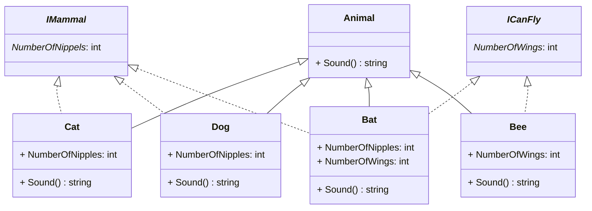

```mermaid
classDiagram
    class Animal{
        + Sound() string
    }

    class Cat{
        + NumberOfNipples: int

        + Sound() string
    }

    class Dog{
        + NumberOfNipples: int

        + Sound() string
    }

    class Bat{
        + NumberOfNipples: int
        + NumberOfWings: int

        + Sound() string
    }

    class Bee{
        + NumberOfWings: int
        + Sound() string
    }

    class _IMammal_{
        _NumberOfNippels_: int
    }

    class _ICanFly_{
        _NumberOfWings_: int
    }

    Animal <|-- Cat
    Animal <|-- Dog
    Animal <|-- Bat
    Animal <|-- Bee

    _IMammal_ <|.. Cat
    _IMammal_ <|.. Dog
    _IMammal_ <|.. Bat

    _ICanFly_ <|.. Bat
    _ICanFly_ <|.. Bee
```